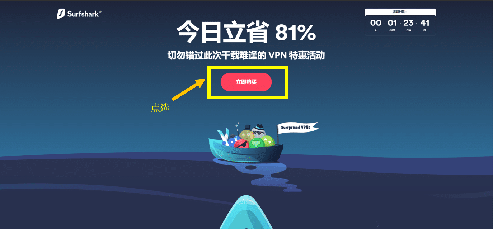

# 翻墙软件中国VPN推荐，推荐四款以下好用(2022年5月最新) 含性价比比较，只剩四款能用

最近更新：`2022年5月8日`

>**据中央社引述中国官方消息报道，中国上网人数突破9亿，网购用户超过7亿，可见大家对上网的需求日益增加, 有鉴于网路上许多博主到处乱推荐VPN，都推荐一堆不能用的，不能用的就算了，还要骗大家去买来拿钱，这类博客有个特点，就是喜欢自己架一个网站，写一堆话来骗大家，近几年来，防火墙更新越来越强大，过去许多VPN已经完全不能使用。为了让大家能够持续的有知的自由，再加上太多网站喜欢说不实的讯息，我决定在github上建造一个网页，作为自由博客，帮助大家避坑，不要再浪费时间在那些危险的VPN或是不能用的VPN上。本文会介绍细节，讲一些技术，只想看翻墙科学软件推荐的朋友(如果只想快速选个科学上网软件来翻墙)，可以直接看我的推荐栏位。

多年中美工作经验告诉我，翻墻几乎是现代人必备的一个技能，由于言论审查，只要翻不了墙就不能Google学新的东西，不翻墙就不能看YouTube视频，用facebook，line和外国朋友联络，Coursera和Udemy等线上课程都不能好好观看。HBO、Netflix等影视娱乐也必须要翻墙才能观看，BBC,CNN等国际新闻也都必须要借由翻墙才观看。我本人由于跨国工作，经常要在不同地区使用科学上网，我本人自己也是网路程序员，博士是研究机器学习，也研究过网路相关问题，我将会在下面详细介绍VPN、SSR、WireGuard、V2Ray、Trojan等翻墙和信息安全技术和基本加密技术，我也将就自己的使用感受和对翻墙软件的了解，自己进行数值实验和速度测试，为读者推荐在国内最好用、稳定和安全的科学上网方法和工具。

直接讲我本人的推荐

### 常见的主流翻墙软件协议
以下是与翻墻相关的几个专业术语。了解这些术语可以帮助您在选择翻墻时获得更好的基本信息，并且更多可以是整个组织中最彻底和详细的专业分类 - 包括实践。如果你只是想快速翻墻，可以直接看翻墙推荐软件。

- **VPN**
知道如何翻墙成功的同伴可能听说过 VPN 一词，以了解 VPN 与什么连接。 VPN目前是一种加密策略，可以保护客户的IP、区域和个人数据不被泄露。 VPN 可以被视为一种伪装（如果从学术上讲，加密更重要的话）。在屏蔽（加扰）客户端 IP、IP 和个人数据后，他们可以通过防火墙到达一些墻外世界。
同时，多数人频繁使用 VPN 背后的动机并不是来通过防火墙（就像我在Covid期间同时看到许多远端工作者VPN 一样）。然而这类传统VPN的已经不足以应付中国政府利用强大的国家优势制造的超级防火墙，传统的VPN在中国已经没有机会了。

### 国产VPN推荐功能总结——2022年测试
以下是我从数百个VPN中实际测试过的一些中国最好的VPN。实际测速对比，可以参考下方测速报告段落。我在中国从事与美国的贸易工作多年。 我用过很多互联网推荐的翻墙软件。我认为一个好的软件应该包括以下功能：

- 高安全性（非中国公司，尽量不要设在中国）
- 连接稳定
- 越快越好
- 更多节点（可连接更多国家）
- 简单易用（一键翻墙）
- 拥有最强的加密隐私安全功能
- 支持同时连接多个设备
- 兼容性强：包括可以同时使用windows、linux、android等设备的设备
- 7天24小时中文客服
- 有30天退款机制
- 有多种支付方式
- 价格正常（公平合理），CP值正常

### 1.<a rel="nofollow noopener" href="https://strongvpn.com/?tr_aid=60d96b5810e50&chan=w_github&data1=pc-vpn&data2=table" target="_blank">StrongVPN–性价比最高</a>

### StrongVPN 推荐

StrongVPN属于最近兴起的欧美VPN。与欧美最大的ExpressVPN相比，价格便宜很多，最低每月3.5美元（12个月计划-每月3.5美元（总费用43.99美元）。ExpressVPN费用接近6美元不仅如此， StrongVPN支持支付宝，ExpressVPN不支持。还有一个工程团队不断更新和修复节点。如果你只是想在线观看YouTube或Facebook，我推荐StrongVPN。StrongVPN网站声称它是“最好的多媒体VPN”，并且建议支持 Netflix、Hulu、ABC、HBO 和 Sky Go 等服务。

StrongVPN 拥有适用于 Windows、Mac、iOS、Android 和 Amazon Fire TV 的应用程序，例如 Chrome 浏览器扩展程序，以及路由器、Fire TV、Kodi 等的设置指南。 StrongVPN 在超过 35 个国家的 46 个城市提供超过 950 台 P2P 友好服务器。您可以通过 L2TP、SSTP、OpenVPN、IKEv2 甚至现在的 WireGuard 协议进行连接，并通过电子邮件和实时聊天获得 24/7 客户支持以及 30 天退款保证。没什么花哨的，但规格很不错，对大多数人来说绰绰有余。

### Strongvpn 的特色

介绍StrongVPN的功能：

- 广泛的平台支持
- 最多支持 12 个同时连接
- 解锁 Netflix、Amazon Prime Video、Disney Plus
- 250GB SugarSync 存储空间，包年套餐
- 超过 8000 台服务器
- 可以通过 L2TP、SSTP、OpenVPN、IKEv2 甚至 WireGuard 协议进行连接
- 30天退款保证
- 提供 24/7 客户支持
- StrongVPN的隐私政策：在您使用VPN服务时，您的数据不会被跟踪或存储
- 价格比ExpressVPN、Surfshark等欧美VPN便宜。最近，测试节点的速度和数量已经超过了ExpressVPN。
- 支持支付宝。
- 高稳定性
- 每月只需3.50 美元（12 个月计划 – 每月 3.50 美元（总成本 43.99 美元）

### 2 <a rel="nofollow noopener" href="https://www.xvuslink.com/?a_fid=wall101">Expressvpn (買12個月送三個月)</a>
### Expressvpn (買12個月送三個月)

### Expressvpn 的特色

ExpressVPN是全球最大的VPN公司，提供自有资源快速更新，ExpressVPN拥有超宽网络（3000多台服务器的安全网络），提供，快速，连接Netflix和几乎所有内容，支持种子下载，绝对记录用户日志记录，几乎所有人都可以使用。 每次当前监控的百分比总是在稳定区域同步更新。在国内达到九成翻墙成功机率，是墙体成功率最高的欧美公司。它属于最高级别的VPN，唯一的问题是价格有点高。特点如下：

- 多达 160 个地点，遍布 94 个国家/地区
- 非常多的用户
- 每次开机，总能快速更新服务器
- 30 款免费游戏
- 24/7 客户服务
- 适用于 Windows、Mac、Android、iOS、Linux 和其他操作系统的应用程序
- 还包括 Apple TV、Fire TV、PlayStation、Chromebook、Kindle
- ExpressVPN 提供各种货币的支付方式，甚至比特币
- 工业级加密

### 3 <a rel="nofollow noopener" href="https://get.surfshark.net/aff_c?offer_id=323&aff_id=5585&source=w_github&aff_sub=fanqiang">Surfshark (具有無限多設備連接)</a>
### Surfshark VPN (衝浪鯊) 推荐

Surfshark 是一款高度精致且功能强大的 VPN，可与最好的优质提供商竞争，同时提供极具吸引力的价格点。我们发现终止开关存在一些非常小的问题，而且 OpenVPN 的速度并不是最好的，但是以这个价格，你找不到更好的 VPN。Surfshark 在网络上受到广泛推荐，成立于 2018 年，是一项相对较新的服务，已经引起了轟動，现在它能与最大的VPN提供商一较高下，被认为是市场上最好的 VPN之一。

### Surfshark VPN 的特色
- 介绍性优惠超级便宜
- 全新的安全审核让您高枕无忧
- 出色的流媒体性能
- 客戶支持非常有用
- Surfshark 在 65 个位置拥有 3,200 多台健康的服务器和无限的同时连接，加上行业标准的 AES-256-GCM 加密
- 無限多台設備連接
- Surfshark 最大的吸引力在于它的价格，在撰写本文时，**2 年计划的价格为每月 2.30 美元。是我見過最便宜的VPN廠商**

### 4 <a rel="nofollow noopener" href="https://www.flowvpx.com/sign-up/?locale=zh-cn&special=FREETRIAL&r=35-890485.w_github">FlowVPN(免費試用兩天)</a>
### FlowVPN 推荐

### FlowVPN 的特色

### 为什么不在自己的计算机 上建立VPN（建立自己的梯子）来翻墙呢？
有人会担心，海外VPN不依赖大众。看到老王VPN、Lantern VPN等案例后，被警察叫去喝茶，所以想自己建VPN，自己架服务器。在这里，我强烈建议不要建立在自己的计算机VPN建立翻墙软体，原因如下。
- 1 虽然网上有很多流行的开源协议如SSR、V2ray、木马等搭建天梯，但如果你有一定的技术实力，可以考虑自己做，但很可能会浪费很多时间。原因很简单，因为这些开源软件，中国的开发者也能看到，他能看到你的代码，他肯定早就和你打过交道了。以前的蓝光VPN开源软件一开始可以用，现在不能用了。
- 2 其次，需要自己花钱架设服务器。服务器非常昂贵，需要维护。你必须永远不能断电，所以你的家庭服务器必须一直打开。你可以成功翻墙。更新防火墙后，您还必须一起更新算法。为什么要自己造轮子？
- 3 你只要在国内搭建或是卖翻墙工具就是明确违法行为，违反《中华人民共和国计算机信息网络国际联网管理暂行规定》)，就算你只是个人使用，保证违法。如果你再分享给朋友使用，你就明确违法，这就不单单只是被公安叫去喝茶罚500这么简单

### 为什么不推荐免费的VPN？
有人会问：为什么不推荐免费的电脑VPN？

- 1 免费电脑VPN有广告。如果有广告，你的速度会变慢，影响你观看视频的体验。
- 2 免费电脑 VPN 通常有一个未知的公司地址。跑了，找不到人负责，尽量不要用，浪费时间
- 3 免费电脑VPN可能含有恶意软件、木马程序，您的个人信息可能会被窃取，包括信用卡、个人账号密码等信息，由于免费且不承担任何法律责任，可能含有挖矿软件。
- 4 根据这几年被公安叫喝茶的经历，都是免费的VPN外包，最著名的就是老网VPN和彩灯VPN的案例。我们再看一个公安叫来的免费VPN喝茶的例子。 .
结论：永远不要碰任何免费的VPN。你报警喝茶的罚款就够你买一年的ExpressVPN了。

### 翻墙软件中国VPN推荐
总结一下，绕过防火墙的方法有很多，但以我自己的经验，购买付费 VPN 仍然是大多数用户的最佳选择。本文推荐的VPN不仅适用于Windows用户，还可以安装在手机、平板等操作系统上。这些VPN基本上使用起来非常方便。
而且虽然我们说的是VPN技术，但是现在大部分主流的VPN都包含了SSR、Trojan、V2ray等开源方式，所以基本上是所有技术的融合。
最后，让我们谈谈免费 VPN。我不建议您使用任何免费的计算机 VPN。首先，能不能上网是个问题，而且你可能安装了恶意挖矿软件，会给你的信息安全带来很大的隐患，所以真心建议大家不要贪小便宜，你甚至可能会被要求喝茶。你可以看到我提到的老网VPN和蓝灯VPN的案例。
如果您对电脑VPN有任何疑问，请在下方留言，我会一一解答。

## 中国翻墻VPN黑名单(千万不要入坑，不要使用)

## 中国VPN推荐标准以及必要的特色

### 1 各種操作系統均支持
如果你运行的是 Windows 或 macOS，多數人不必担心这个问题。大多数VPN还具有适用于Android和iOS的移动应用程序。 但是，如果你运行的是Linux或其各种特別的发行版，例如 Ubuntu，则情况并非如此。大多数VPN仅提供适用于 Linux 的命令行应用程序，而Expressvpn 和strongvpn 是少数具有完整 Linux 应用程序的 VPN 之一。

### 2 多少設備同時連接
Expressvpn，StrongVPN，flowvpn，最多允許五種設備連結，surfshark則可以允許無限多台設備連接，这里要记住的一件事是，这只是你可以同时连接的设备数量。你仍然可以在無限多的设备上安装和运行 Expressvpn，StrongVPN，flowvpn 等服务——你只是无法同时在所有设备上运行 VPN。

### 3 拆分隧道技巧
拆分隧道(英文稱作VPN split tunneling)，簡單說就是: 拆分隧道允许您选择哪些应用程序将通过VPN运行，哪些应用程序将不受保护。比方我在國內一個瀏覽器聽愛奇異，另一個瀏覽器在看IEEE的文章(研究生的日常)，愛奇異就不需要通過VPN，IEEE則需要通過VPN，這樣讓你的平均速度的最大化。通常當你運行VPN時候，local端的速度會降低，因為中間的傳輸VPN加密需要時間。隧道拆芬可以部份解決這個問題。

### 4 带宽(bandwidth)
这是一个经常被误解的主題，很多博主搞不清楚带宽限制和数据限制的差別。带宽决定了你一次可以传输多少数据。簡單說，你拥有的带宽越多，你可以传输的视频质量就越高。拥有无限带宽意味着连接到 VPN的其他人不会影响你的速度。再舉個例子: 另一方面，数据限制决定了你在特定时间段内可以使用的流量。例如，如果你的每日数据流量限制为10GB，您可以观看两到三部高清电影，或下载 10GB 的文件。

### 5 七天24小時 客户支持
通常有兩種方法，ExpressVPN 等高級VPN提供商提供聊天(online chat)作为主要支持形式。更多大多数提供商允许你直接通过电子邮件溝通，strongvpn 和expressvpn都有即時聊天系統。

### 6 30天內退款保证
如果你对为你購買的VPN犹豫不决，你会很高兴听到大多数 VPN 提供30天內退款保证

## VPN 隐私功能
### 7 無日誌政策
无日志政策幾乎是VPN必要條件，簡單說: 他永远不会记录或存储您的数据。但是，除了检查VPN提供商的历史记录是没有什么好方法可以知道哪些提供商会真正的清除用戶的紀錄。過去有不少VPN號稱無紀錄，但是後面被發現 偷偷的販售使用者資料，這類VPN，我有整理在下方。大家千萬不要使用。

### 8 多元付款方式 
包含 信用卡，master card, visa card。paypal。支付保alipay，ExpressVPN甚至允许你使用比特币等加密货币进行支付。

### 9 安全性高: 使用最新的加密系統
加密的原理需要用到很多數學，這裡不在詳述，VPN使用加密协议对您的数据进行加扰，并使用加密密钥确保其安全。你很可能会看到以字母和数字组合命名的加密类型，例如 AES-256、RSA-4096。這都是不同的加密演算法，牽涉到很多代數相關的問題，簡單說 数字越大，加密协议越安全。

### 10 各種VPN协议
在VPN裡面，有各種協議，PPTP vs. OpenVPN vs. L2TP/IPsec vs. SSTP各種協議。每種協議針對不同設備跟用途各有優劣，這裡不再做詳述

### 11 VPN自动化的功能
VPN現在會自动执行VPN连接，因此你不会意外连接到不受保护的互联网。例如，你可以选择连接到离你最近的服务器，或你最后连接的位置。但并非所有VPN服务都提供相同的自动化功能。

### 12 VPN终止开关
VPN終止開關是另一个自动化功能，如今几乎是标准的VPN功能。如果你的VPN由于某种原因停止工作，它会自動切断你的互联网连接。这可确保你始终受到安全VPN连接的保护，即使VPN突然连接中断，你也會馬上離開互聯網。保障你的安全

## VPN 服务器的分析
VPN服務器的分布，也是一個很VPN效能的關鍵因素，第一: 服务器的数量当然重要，但更重要的是它们的分布方式以及它们覆盖的国家/地区。你离VPN服务器越近，连接速度就越快。

### 實體vs虚拟服务器
實體服务器是存在于现实世界中的硬件(硬體速度比軟體快)。它在幫助提供商端运行VPN软件，当你使用VPN时，它就是您连接和发送流量的工具。實體服务器（在大多数情况下）比虚拟服务器更快。虚拟服务器是在實體服务器上运行的模拟服务器，可能位于不同的位置。ExpressVPN使用一些虚拟服务器为他们的用户提供他们无法操作的国家/地区的访问权限。例如，如果某个国家/地区已禁止 VPN(像是中國)，或者如果在那里建立硬體服务器在经济上不可行(非洲國家)，则VPN可以使用虚拟服务器来提供对该位置的访问。

### 媒体服务器 
媒体服务器是针对带宽密集型任务（通常是多媒体影音平台）來進行优化的服务器。并非所有服务器的构建方式都相同，由于位于高流量位置，某些服务器的容量可能会降低。媒体服务器应该（理论上）为繁重的任务提供更好的连接，并隐藏你正在使用VPN的事实，因此媒体网站不会阻止你。

### P2P服务器
P2P（或“点对点”）网络是您可以直接从其他用户的计算机下载文件的地方，而不是集中式服务器。特別適合torrent的下載如，果您打算使用 VPN 进行种子下载，那么使用专用服务器总是有帮助的。除了额外的带宽容量，这些P2P服务器还提供额外的安全措施。

## 你必须知道的VPN的核心知识

#### VPN的基本原理是什么？

VPN是英文Virtual Private Network的缩写，VPN 的一个关键部分是加密。数学上非常复杂，你只要知道加密会扰乱您的数据，您只能使用正确的密钥对其进行解密。
您的所有数据在进入互联网之前都会通过某些加密隧道，这样其他人无法看到这些数据。这允许您隐藏连接到网站时浏览器自动发送的元数据。浏览器携带大量数据，包括您的时区、内容语言、操作系统，甚至您的屏幕分辨率。尽管这些数据都不能直接识别您的身份，但整个集合可能对您来说是独一无二的，某些人可用于通过称为浏览器指纹识别的过程来识别您。政府机构、广告商和黑客可以利用这些信息来对付您。所以这就是你为何需要VPN

#### 什么是中国防火长城？

与其他国家采用的法规相比，中国以严格的互联网信息控制政策着称。这个工程通常被称为“中国的巨大防火墙”(great firewall)，是由中国政府公安部管理的一项倡议。顾名思义，这个项目的重点是监控和审查通过中国在线网络可以看到和不能看到的内容。该项目始于1998年，至今仍在通过多种方法不断改进限制技术。OpenNet Initiative 进行了一项实证研究，得出的结论是，中国拥有“世界上最复杂的内容过滤互联网制度”。使用的一些技术方法是 IP 阻塞，即拒绝特定域的 IP 地址。为了了解该政策的严格程度 包含了美国最受欢迎的网站列表 [实证研究](https://www.example.com/my%20great%20page)。谷歌、Facebook、雅虎位列前三；在这前三名中，没有一个是在中国被允许的。这是可以预料的，因为可以通过这些社交领域快速传播信息。网站让用户可以看到他们输入的域名在中国是否被屏蔽，是展示中国广泛使用的过滤的便捷工具。

#### VPN可以做什么？

通过以上对VPN的原理和防火长城的原理，有了一定了解之后，就会明白VPN可以做很多事情，那是因为它会改变你的IP地址。每台计算机在连接到互联网时都有一个唯一的 IP 地址，这会告诉其他计算机您在世界上的哪个位置。使用 VPN，您可以在访问 Internet 之前连接到另一台计算机（服务器），从而有效地告诉其他计算机您在不同的位置。对于大多数 VPN 服务，您实际上可以自己选择这个伪造的位置。

有了新的 IP 地址，就有很多可能性。例如，Netflix 等流媒体平台针对世界不同地区提供不同的内容。VPN 会改变您的IP位置，允许您访问其他国家的流媒体库。

在极端情况下，VPN 有助于绕过部分网路审查。世界各地的一些政府机构使用地理封锁，这是一种基于您的 IP 地址对内容进行区域锁定以阻止网站和服务的技术。VPN 通过更改您的 IP 地址并让您看起来像是从不同位置连接到互联网来解决这个问题。

另一方面，VPN 消除了个人上网的责任，因此有些人将它们用于（也称为点对点文件共享）受版权保护的内容和从事其他在线非法活动。

以下是您可以使用 VPN 执行的一些用途：

- 解锁流媒体平台：一些流媒体平台仅在某些位置可用，并且大多数针对不同地区有不同的库。VPN 可让您解锁流媒体平台并浏览来自世界各地的内容。
- 绕过审查：一些政府阻止其居民访问某些网站和服务。VPN 会更改您的虚拟位置，让您可以绕过审查并查看世界其他地方的可用内容。
- 停止在线跟踪： VPN 服务提供加密隧道，阻止您的互联网服务提供商和网站跟踪您的 IP 地址、地理位置和浏览器元数据等数据。
- 访问专用网络：您可以使用 VPN 远程连接到专用网络。尽管您仍在使用互联网，但 VPN 在专用网络和开放网络之间提供了一道屏障。

#### VPN真的有用(有效)吗？
关于 VPN 的有效性，一直以来都有争议，但由于我多年经验，有一点秘诀。只要您坚持使用信誉良好的付费VPN服务，例如我这里推荐的expressvpn，Strongvpn等等，您的 VPN 就可以正常工作。

不过，有些人还是不相信，也不能怪他们。举个例子，Facebook 提出每月向移动用户支付 20 美元以连接到 VPN。根据 TechCrunch 的一项调查，这个 VPN（有时被称为 Project Atlas)能使Facebook 能够访问移动设备的root权限，偷偷存取您的资料。

还有像 Hola 这样的免费 VPN，它提供连接到 Luminati 网络的免费 VPN 服务。该网络的订阅者每月支付费用，以使用 Hola 的免费 VPN 服务从设备访问带宽，实质上是在不知情的用户硬件上创建了一个僵尸网络。值得注意的是，自从问题浮出水面以来，Luminati 已经纠正了他们与僵尸网络相关的问题。

如果您连接到 VPN，您可以进行快速测试以查看它是否正常工作。

